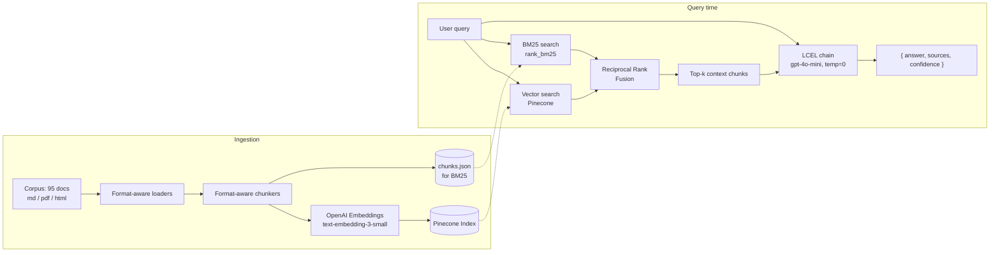

# Helix Support Assistant — RAG Checkpoint

## Summary

This is a v1 internal RAG support assistant for Helix, a fictional B2B SaaS workflow automation
platform. It ingests Helix's ~100-document knowledge base (product docs, internal runbooks, and
resolved support tickets) into a Pinecone vector index, retrieves relevant context using a hybrid
(BM25 + vector) search combined via Reciprocal Rank Fusion, and generates grounded, citation-backed
answers with an explicit confidence rating using an LCEL pipeline. Evaluated against the provided
50-query test set with RAGAs, the system scores 0.939 faithfulness and 0.775 context precision,
comfortably clearing the required 0.70 / 0.60 thresholds.

## Architecture



## Chunking Strategy

Three formats, three strategies — a single one-size-fits-all splitter would either mangle
Markdown's header structure or split ticket conversations at the wrong place:

- **Markdown (product-docs/)** — split by header (`#`/`##`/`###`) first with
  `MarkdownHeaderTextSplitter`, so a chunk never crosses a topic boundary. Any section still too
  long is then broken up with a recursive character splitter (**1000 chars, 150 overlap**). This
  keeps each chunk topically coherent — a "Delete a workflow" section stays intact rather than
  bleeding into "Create a workflow."
- **PDF, text-native (runbooks/)** — no header structure to exploit, so a straight recursive
  character splitter (**1000 / 150**) is applied to the extracted text.
- **HTML (tickets/)** — kept as **one whole chunk per ticket** when the ticket is under ~3000
  characters (true for nearly all of them). The corpus README explicitly notes that a ticket's
  resolution often appears only in the final agent turn — splitting a ticket risks separating the
  question from its answer, which would silently break retrieval on ticket-only facts. Longer
  tickets fall back to a recursive splitter (1500 / 200).
- **Scanned PDFs (5 of 25 runbooks)** — no extractable text layer. Detected via a minimum
  extracted-character threshold and **skipped gracefully** rather than OCR'd (a conscious choice,
  see "What I'd do with another week" below) — ingestion logs each skipped file and never crashes.

Result: 95 of 100 documents ingested, 426 chunks produced.

## Retrieval Strategy

**Implemented improvement: hybrid search (BM25 + vector), combined via Reciprocal Rank Fusion.**

**Reasoning going in:** pure vector search can miss queries that hinge on an exact term — an error
code, a specific field name, an exact phrase from a ticket — that get blurred by semantic embedding.
BM25 (keyword/lexical scoring) should catch those, while vector search catches paraphrased or
conceptual matches BM25 would miss. RRF combines both rankings by position rather than requiring a
hand-tuned blend weight.

**What I measured, before vs after** (Hit@5 = expected source doc appeared in top-5; Doc-Precision@5
= fraction of the top-5 whose source doc was in `expected_sources`, averaged over all 50 test
queries — see `evals/compare_retrieval.py`):

| Method | Hit@5 | Doc-Precision@5 |
|---|---|---|
| Vector-only | **100.0%** (50/50) | **0.288** |
| Hybrid (RRF) | 94.0% (47/50) | 0.248 |

**Honest finding: hybrid search did not improve retrieval on this corpus — vector-only was actually
slightly better on both measures.** My hypothesis going in was wrong, and I'm reporting that rather
than the result I expected. My read on why: this corpus is mostly natural, well-formed prose (product
docs, runbook text) rather than dense with the exact-match triggers (IDs, codes, rare tokens) where
BM25 usually earns its keep. RRF fusion appears to occasionally push a correct vector hit that ranked
just outside the top candidates out of the final top-5, in favor of a BM25 match that shares surface
keywords but isn't the right document — this is a plausible explanation for the 3 queries hybrid lost
that vector alone caught.

Despite that, the **end-to-end generation-level eval** (context precision via RAGAs, judged at the
chunk-relevance level rather than strict doc-id match) still passed its threshold comfortably at
0.775 — the two precision metrics aren't directly comparable, but it suggests hybrid isn't badly
hurting overall answer quality even where it underperforms on this stricter doc-hit measure.

## Generation Prompt

```
SYSTEM_PROMPT = """You are the internal support assistant for Helix, a B2B SaaS workflow \
automation platform. You answer Customer Success team questions using ONLY the context \
provided below — product docs, internal runbooks, and resolved support tickets.

Rules:
1. Base your answer strictly on the provided context. Do not use outside knowledge about \
Helix — the context is your only source of truth.
2. If the context does not contain enough information to answer confidently, say so \
explicitly (e.g. "The provided context doesn't cover this") rather than guessing or filling \
gaps with plausible-sounding information. This matters more than sounding complete.
3. In `sources`, list ONLY the raw doc_id value (e.g. "product-docs/api/errors.md") of every \
context chunk you actually relied on — never include the word "doc_id" or brackets, and do not \
invent doc_ids that weren't provided.
4. Set `confidence` using the definitions provided for that field.

Context:
{context}
"""
```

Structured via Pydantic (`RAGResponse`: `answer: str`, `sources: list[str]`,
`confidence: Literal["low", "medium", "high"]`), enforced with LangChain's
`with_structured_output`, using `gpt-4o-mini` at **temperature=0**.

**Why temperature=0:** a support assistant answering the same question against the same context
should give the same answer every time — determinism matters more than creative variation here.
(This is a real example I can point to for the exam's temperature question.)

**Why rule 2 (admit uncertainty) is the most important line in the prompt:** it's directly what the
faithfulness metric rewards. An honest "I don't know" scores *better* on faithfulness than a
plausible-sounding guess that isn't grounded in the retrieved context — Q017 in the failure analysis
below is a clean example of this working as intended.

## Eval Results

Full 50-query results: `evals/results/results.json` (machine-readable),
`evals/results/summary.md` (human-readable, per-query breakdown).

| Metric | Score | Threshold | Result |
|---|---|---|---|
| Faithfulness | **0.939** | ≥ 0.70 | ✅ PASS |
| Context Precision | **0.775** | ≥ 0.60 | ✅ PASS |
| Answer Relevancy | 0.817 | (tracked, no required floor) | — |

### Three representative failure cases

**1. Q017 — Pure retrieval miss.**
*Query: "What does HTTP 401 mean from the Helix API?"*
Expected sources (`api/errors.md`, `api/authentication.md`) were never retrieved. The system
answered "The provided context doesn't cover this" rather than guessing — faithfulness scored 1.00
(the non-answer is technically faithful to empty context) but relevancy/precision both scored 0.00.
**Root cause: retrieval, not generation.** This is exactly the kind of query hybrid search was
supposed to help with (an exact term, "401"), yet it still missed — worth revisiting given the
before/after finding above.

**2. Q037 — Retrieval succeeded, generation still failed.**
*Query: "How do I send a Helix webhook to a custom URL?"*
Context precision = **1.00** — the correct source document (`integrations/custom-webhooks.md`) *was*
retrieved. Yet faithfulness = 0.00; the model still answered "doesn't cover this." **Root cause:
chunk-granularity gap** — the specific chunk retrieved from the right file didn't happen to contain
the actual instructions, even though the file itself was correctly identified. Retrieving the right
document doesn't guarantee retrieving the right chunk within it.

**3. Q046 — Incomplete synthesis on a hard, multi-document query.**
*Query: "Customer says they were charged for an overage but they're sure they were under their
limit. How do we investigate?"*
Expected 4 sources spanning billing docs, a refund runbook, and a ticket; the system cited only 1 (a
resolved ticket) and produced a plausible but under-grounded answer (faithfulness 0.65). **Root
cause: top-k=5 retrieval didn't surface all four relevant documents simultaneously** for a query that
genuinely needs cross-corpus synthesis — the hardest category the corpus README warned about.

*(A fourth issue found during this analysis, not query-specific: `sources` occasionally contained the
literal string `"doc_id: ..."` instead of a clean path, because the model copied the context block's
label format. Fixed by rewording the prompt's rule 3 and changing the context label from
`[doc_id: X]` to `SOURCE: X`.)*

## How to Run

```bash
pip install -r requirements.txt
copy .env.example .env   # fill in your OpenAI + Pinecone API keys
python -m src.ingest --corpus "../corpus"
python -m src.pipeline "your question here"
python -m evals.harness
```


## What I'd Do With Another Week

Ranked by expected impact:

1. **Investigate the hybrid-search regression.** The before/after data shows hybrid underperforming
   vector-only on this corpus. I'd try: (a) tuning the RRF constant and candidate-pool size, (b)
   only invoking BM25 for queries containing likely exact-match tokens (numbers, error codes, capitalized
   identifiers) instead of always blending it, and (c) trying reranking (Cohere Rerank) as an
   alternative improvement to compare directly against hybrid on the same test set.
2. **Fix the chunk-granularity gap (Q037-style failures).** Retrieving the right document but the
   wrong chunk within it suggests either smaller chunk sizes with more overlap for dense procedural
   docs, or a parent-document retrieval strategy (retrieve small chunks for precision, but pass the
   full parent section to generation for completeness).
3. **Improve hard-query synthesis (Q046-style failures).** Increase k specifically for queries
   classified as needing cross-corpus synthesis, or retrieve separately per source category
   (docs/runbooks/tickets) and merge, rather than one flat top-k across everything.
4. **Add OCR for the 5 skipped scanned PDFs**, now that the rest of the pipeline is proven — Tesseract
   OCR integration, with a quality check before trusting the extracted text.
5. **Track context recall and answer correctness**, not just the three required metrics — the corpus
   README's `notes` field (e.g. "answer must include the number 100") is clearly designed for a
   correctness check I haven't built yet.
6. **Add basic production monitoring**: per-query latency (p95), retrieval hit-rate against a
   sampled ground truth, and a "low confidence" rate alert — right now there's no signal on any of
   these outside a manual eval run.

---

# Module 3: Operational Maturity (Ops & Evaluation Checkpoint)

**LangSmith project:** `hybrid-rag-enterprise-support` · ⟨https://smith.langchain.com/o/2bff5f56-5da3-41c4-a2c7-0087998fc5ca/projects/p/82ca0481-aeb6-40a2-885d-1cd868667859⟩
**Eval dataset:** [`helix-csm-eval-v1.0`](https://smith.langchain.com/o/2bff5f56-5da3-41c4-a2c7-0087998fc5ca/datasets/52d9f6b8-dde7-41e4-a8a0-bd47c47f0a62) (50 queries)
**Loom walkthrough:** ⟨paste public/unlisted Loom link⟩

## Operational maturity summary

On top of the Module 1 RAG (unchanged in `src/`) I added an `ops/` layer that turns "it demos well" into evidence. **Tracing:** every ingestion and query run is a LangSmith trace, with retrieval as a retriever span carrying doc ids and scores and generation traced automatically via LangChain. **Evaluation:** a versioned 50-query LangSmith dataset scored by three LLM judges (faithfulness, answer relevance, and a custom *CSM Resolution Quality* judge) plus four free deterministic diagnostics. **Observability:** Phoenix spans for retrieval latency, LLM latency, tokens and retrieved document ids. These exposed the main weakness: 54% of chunks were heading-only fragments. **Data quality:** an 18-expectation Great Expectations contract that gates ingestion before anything reaches Pinecone. **Monitoring:** a spec with thresholds and actions an SRE can implement. Every pipeline variant is a named config (`v1` = Module 1 baseline, `v2`, `v2-vector`, `v3`), so every number below traces back to exactly what produced it. The baseline was never overwritten: v2 lives in its own Pinecone namespace.

**Final configuration: `v2-vector`**: merged chunks (≥ 400 chars) + PII redaction + vector-only retrieval, k=5, Module 1 prompt.

## Results

All numbers are from the corrected judge (see "Eval iteration log"), 50/50 examples scored.

| Metric | v1 (Module 1) | **v2-vector (final)** | v3 (rejected) |
|---|---|---|---|
| CSM resolution quality (custom) | 0.767 | **0.843** (+0.076) | 0.817 |
| Faithfulness | 0.992 | 0.993 (+0.001) | 0.988 |
| Answer relevance | 0.935 | **0.980** | 0.990 |
| Source hit | 0.940 | **1.000** | 1.000 |
| Source recall | 0.795 | **0.908** | 0.908 |
| Abstention rate | 8% | **4%** | 4% |
| Citation validity | 1.000 | 1.000 | 1.000 |

Experiments: `v1-95772092`, `v2-vector-18afbc62`, `v3-d4e9b0dd`.

**Is +0.076 real?** Two runs of the *unchanged* v1 system scored 0.774 and 0.767 on CSM quality, so run-to-run judge noise is about 0.007. The improvement is roughly 10× the noise.

**Checkpoint gates:** custom judge ≥ 0.75: **met (0.843)**. Faithfulness +0.05 over Module 1: **not met (+0.001)**. It cannot be met: scored consistently, the Module 1 baseline is already 0.992, so the maximum possible gain is +0.008. See the iteration log for how an earlier apparent "pass" turned out to be a measurement error.

## Eval methodology

| Evaluator | Type | What it catches | How it scores |
|---|---|---|---|
| `faithfulness` | LLM judge (standard) | Hallucination: claims not in the retrieved context | Judge lists atomic claims and marks each supported/unsupported; score = supported / total. Abstention statements are removed in code and a pure abstention scores 1.0 (it asserts nothing) |
| `answer_relevance` | LLM judge (standard) | On-topic but not answering the actual question | 1–5 anchored rubric, reasoning before score, normalised to 0–1 |
| `csm_resolution_quality` | LLM judge (**custom**) | Right-sounding answer with the wrong key fact; answers a CSM can't act on; **promises to customers no document authorises** | Judge makes 3 categorical calls (key facts vs. reference + test-set `notes`; actionability; unauthorised commitment). Python combines them: 0.7·facts + 0.3·actionability, capped at 0.25 if a commitment is invented |
| `source_hit`, `source_recall` | deterministic | Retrieval failures | expected sources ∩ retrieved docs |
| `abstained`, `citation_valid` | deterministic | Over-abstention; citing docs that weren't retrieved | regex / set check |

**Why these three judges together:** faithfulness alone can be gamed by abstaining. Relevance and the custom judge both punish unnecessary abstention, and the abstention rate is reported separately.

**Non-obvious decisions:** the judge (`gpt-4o`) is stronger than the generator (`gpt-4o-mini`). The LLM makes categorical calls and code computes the number, because LLMs are bad at choosing "0.73" but decent at "is this claim supported?". The custom judge uses the test set's `notes` field, which Module 1 never used.

**Reproducibility:** the dataset name carries the test-set version, and its description stores a content hash, so changing questions without bumping the version is refused. Each experiment records config, git commit, judge model, generator model and a hash of all prompts. The judge and the generator both run at temperature 0. The runner reports `(scored/total)` per metric, and an `all_examples_scored` gate, so rate-limited evaluator crashes can't silently shrink the denominator. That happened on the first run: `gpt-4o` at 30k tokens/min.

**Calibration against ground truth:** 15 stratified answers (6 easy / 6 medium / 3 hard, including the known failures) from `v2-vector` were scored against the reference answer and grading notes. Draft labels were proposed by an AI assistant, then reviewed and adjusted by me (⟨0⟩ changed). Then `python -m ops.langsmith.calibrate_judge --config v2-vector`:

| MAE | within ±0.25 | Spearman | agreement at 0.75 gate | Cohen's κ | judge − human |
|---|---|---|---|---|---|
| 0.079 | 100% | 0.961 | 80% | 0.545 (target 0.6) | −0.034 |

The judge ranks answers almost identically to the human labels but is slightly harsher. All 3 gate disagreements have the same cause: the scoring formula has no level between "all facts" (1.0) and "partial" (0.53–0.65), so an answer missing one minor fact fails the gate for the judge but passes for a human. Consequence: the reported 0.843 is **conservative**. Proposed fix (not applied, to avoid another tuning pass on the same 50 questions): add a `most` key-facts level (≈0.85).

### Eval iteration log

| Step | What happened | What I did |
|---|---|---|
| 1 | First v1 baseline: `faithfulness 1.000`, but many evaluator calls had crashed with 429 rate limits and were silently dropped | Added retries, lower concurrency, `(scored/total)` counts and an `all_examples_scored` gate |
| 2 | v2 (merged chunks, hybrid): CSM 0.767 → 0.801, faithfulness +0.020 | Kept the chunk fix |
| 3 | v2-vector: CSM 0.843, source hit 100%, faithfulness +0.0485, just short of the gate | Diagnosed the remaining unsupported claims: invented steps (Q026), filler (Q045), extrapolation (Q043) |
| 4 | v3 (stricter grounding prompt): faithfulness +0.064, **gate "passed"** | Pre-registered rule: v3 only counts if CSM quality doesn't drop |
| 5 | Inspected the zeros: the judge scored the identical abstention "The provided context doesn't cover this" as **1.0 for Q037 but 0.0 for Q017/Q033/Q044**, contradicting the metric's own definition | Enforced the documented rule in code (abstention statements removed before scoring) and re-ran v1, v2-vector and v3 |
| 6 | Corrected: v1 0.992 → the gate is unreachable; the "pass" in step 4 was ~0.06 of mis-scored v1 abstentions | Reported the real number |
| 7 | v3 CSM 0.817 < v2-vector 0.843: the stricter prompt dropped required facts (Q025, Q026, Q038 fell from 1.0 to 0.53–0.65) | **Rejected v3** by the pre-set rule; `v2-vector` is final. Stopped tuning on the same 50 questions |

## Observability findings

Full write-up: `ops/phoenix/analysis.md`. Screenshots: `ops/phoenix/screenshots/`.

**Weakness found:** Q037 ("How do I send a Helix webhook to a custom URL?") abstained in v1 even though the right document was retrieved. The RETRIEVER span showed chunk lengths `[96, 209, 489, 243, 85]`: headings with no instructions under them. Root cause, confirmed in the chunk file: header-splitting left **232 of 426 chunks (54%) under 200 characters**.

**Change:** merge Markdown sections to ≥ 400 characters within a document and fold orphan fragments → 176 chunks, median 186 → 637 characters. Q037's chunks became `[564, 420, 489, 583, 933]`, `short_chunks: 0`.

**Measured before vs after (same 15 traced queries):**

| Signal | v1 | v2-vector |
|---|---|---|
| Retrieved chunks < 200 chars | 29.3% | **0%** |
| Median retrieved chunk | 316 | 736 |
| Source hit / abstention | 86.7% / 26.7% | **100% / 6.7%** |
| LLM latency p50 / p95 | 939 / 2,535 ms | 1,029 / 2,584 ms |
| Prompt tokens per call | 1,258 | 1,552 (**+23%**, the cost of the fix) |
| Cost per query | $0.00024 | $0.00030 |

**Two remaining failures, traced to their cause:**
- **Q044 (abstention):** the answer *was* retrieved: ticket HX-1189 at rank 1 describes the identical incident. The model refused because the question asks for a "runbook" and the answer lives in a ticket. That's a generation failure, not a retrieval one; v3's "answer the covered part" rule fixed exactly this case.
- **Q037 (wrong meaning):** both candidate features were retrieved (scores 0.68 / 0.64 / 0.56 / 0.54 / 0.53, no clear winner), and the model answered about the outbound HTTP action instead of the webhook trigger the reference expects. The question is ambiguous, and 3 of 5 slots came from one document.

## Data quality contract

`ops/data_quality/expectations.py`: 18 expectations on the chunk table, run inside ingestion **after embedding and before upsert**.

| Expectation group | Guards against |
|---|---|
| Chunk length: 95% within 200–3000 chars; median 300–1500; hard bounds 20–4000 | Heading-only fragments that win retrieval with no content; runaway chunks that bloat the prompt |
| Metadata: required fields non-null, unique ids, valid category/doc_type, doc_id path format, ≥ 90 distinct documents | Uncitable answers; a loader silently dropping a whole folder |
| Embeddings: every vector 1536-dim, no NaN (checked against the vectors **stored in Pinecone**) | `EMBEDDING_MODEL` changed without rebuilding the index |
| PII: no email (company domains allow-listed), phone, SSN, card number | Customer PII embedded and quoted back to CSMs |

**Verdict:** Module 1 chunks fail 4/18: 232 fragments (54.5%), median 186, a 19-character orphan (`"(RPO is 5 minutes)."` cut off from the failover runbook), and 2 tickets with customer emails. **v2 passes 18/18 on 176 chunks.**

**When one fails:** `ops.ingest` writes the report, upserts **nothing** and exits 1, so a CI job or scheduler fails loudly while the previous namespace keeps serving. This happened for real: a wrong corpus path loaded 0 documents, and the gate blocked the upload. **Known limitation:** regex PII detection catches emails, phones and card numbers, not names. Customer names (e.g. in ticket HX-1189) are still in the index.

## Monitoring plan summary

Full spec: `ops/monitoring/monitoring_spec.md`.

| Metric | Threshold → alert | Rationale |
|---|---|---|
| Unauthorised commitments (nightly eval) | ≥ 1 → page | The one failure that directly costs money with a customer |
| Abstention rate | 1h > 15% (≈3× the 4–7% baseline) with ≥ 10 queries → page | Cheapest signal that retrieval broke (empty namespace, wrong embedding model); no LLM call needed |
| Retrieval latency p95 (warm) | > 1.2 s for 15 min → ticket; > 3 s → page | Warm retrieval measured 230–620 ms; a sustained doubling of the warm max means Pinecone-side slowdown, not one bad query. Cold starts (4.7 s on the first query) are excluded by warming up at startup |
| Online faithfulness (sampled) | 24h mean < 0.95 → ticket; < 0.90 → page | Baseline 0.993; hallucination early warning without references |
| Prompt tokens / query p95 | > 3,000 (≈1.5× the 2,039 baseline) → ticket | Context bloat shows up here before it shows up on the bill |

## Production readiness verdict

**HOLD: pilot with 5 CSMs.** Full report: `reports/production_readiness.md`. Quality gates pass (CSM 0.843, faithfulness 0.993, source hit 100%, p95 3.7 s, data contract 18/18). But 5 CSM runbooks (VIP escalation, custom SLA handling, plan downgrade, onboarding, QBR) are scanned PDFs that were never ingested, and only 1 of 50 eval questions is a CSM-workflow question. Q050 shows the gap directly: it needs `custom-sla-handling.pdf`, which the system cannot see.

**Evidence that would change my mind:**
1. After OCR-ing the 5 runbooks and adding ~15 CSM-workflow questions (dataset v1.1), CSM quality ≥ 0.75 on that subset → **SHIP** to all 40.
2. CSM quality < 0.75 on the CSM subset even with the runbooks ingested → keep HOLD, target answer completeness (the dominant failure is "partial facts"); no progress after two iterations → **KILL** for CSM workflows and restrict to product-doc Q&A.
3. Any unauthorised commitment in pilot traffic, or > 20% 👎 → stop the pilot immediately.

## How to run (Module 3)

```bash
pip install -r requirements.txt              # pins resolved in pyproject.toml
copy .env.example .env                       # add LANGSMITH_API_KEY

python -m pytest tests/                      # Module 1 + 45 ops tests (ops tests are offline)
python -m ops.langsmith.setup                # project + versioned dataset, prints URLs
python -m ops.langsmith.run_evals --config v1 --concurrency 1               # baseline first
python -m ops.phoenix.instrument --config v1                                # find the weakness
python -m ops.data_quality.run_validations --config v1                      # contract fails on v1
python -m ops.ingest --corpus "<path to corpus>" --config v2                # gated ingestion
python -m ops.data_quality.run_validations --config v2                      # 18/18
python -m ops.langsmith.run_evals --config v2-vector --compare-to v1 --concurrency 1
python -m ops.langsmith.compare_runs v1 v2-vector                           # per-question diff
python -m ops.phoenix.instrument --config v2-vector                         # after traces
python -m ops.langsmith.calibrate_judge --config v2-vector                  # after labelling
```
