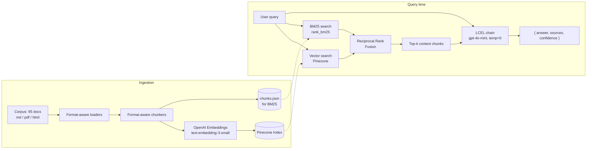

# Helix Support Assistant — RAG Checkpoint

## Summary

This is a v1 internal RAG support assistant for Helix, a fictional B2B SaaS workflow automation
platform. It ingests Helix's ~100-document knowledge base (product docs, internal runbooks, and
resolved support tickets) into a Pinecone vector index, retrieves relevant context using a hybrid
(BM25 + vector) search combined via Reciprocal Rank Fusion, and generates grounded, citation-backed
answers with an explicit confidence rating using an LCEL pipeline. Evaluated against the provided
50-query test set with RAGAs, the system scores 0.939 faithfulness and 0.775 context precision,
comfortably clearing the required 0.70 / 0.60 thresholds.

## Architecture



## Chunking Strategy

Three formats, three strategies — a single one-size-fits-all splitter would either mangle
Markdown's header structure or split ticket conversations at the wrong place:

- **Markdown (product-docs/)** — split by header (`#`/`##`/`###`) first with
  `MarkdownHeaderTextSplitter`, so a chunk never crosses a topic boundary. Any section still too
  long is then broken up with a recursive character splitter (**1000 chars, 150 overlap**). This
  keeps each chunk topically coherent — a "Delete a workflow" section stays intact rather than
  bleeding into "Create a workflow."
- **PDF, text-native (runbooks/)** — no header structure to exploit, so a straight recursive
  character splitter (**1000 / 150**) is applied to the extracted text.
- **HTML (tickets/)** — kept as **one whole chunk per ticket** when the ticket is under ~3000
  characters (true for nearly all of them). The corpus README explicitly notes that a ticket's
  resolution often appears only in the final agent turn — splitting a ticket risks separating the
  question from its answer, which would silently break retrieval on ticket-only facts. Longer
  tickets fall back to a recursive splitter (1500 / 200).
- **Scanned PDFs (5 of 25 runbooks)** — no extractable text layer. Detected via a minimum
  extracted-character threshold and **skipped gracefully** rather than OCR'd (a conscious choice,
  see "What I'd do with another week" below) — ingestion logs each skipped file and never crashes.

Result: 95 of 100 documents ingested, 426 chunks produced.

## Retrieval Strategy

**Implemented improvement: hybrid search (BM25 + vector), combined via Reciprocal Rank Fusion.**

**Reasoning going in:** pure vector search can miss queries that hinge on an exact term — an error
code, a specific field name, an exact phrase from a ticket — that get blurred by semantic embedding.
BM25 (keyword/lexical scoring) should catch those, while vector search catches paraphrased or
conceptual matches BM25 would miss. RRF combines both rankings by position rather than requiring a
hand-tuned blend weight.

**What I measured, before vs after** (Hit@5 = expected source doc appeared in top-5; Doc-Precision@5
= fraction of the top-5 whose source doc was in `expected_sources`, averaged over all 50 test
queries — see `evals/compare_retrieval.py`):

| Method | Hit@5 | Doc-Precision@5 |
|---|---|---|
| Vector-only | **100.0%** (50/50) | **0.288** |
| Hybrid (RRF) | 94.0% (47/50) | 0.248 |

**Honest finding: hybrid search did not improve retrieval on this corpus — vector-only was actually
slightly better on both measures.** My hypothesis going in was wrong, and I'm reporting that rather
than the result I expected. My read on why: this corpus is mostly natural, well-formed prose (product
docs, runbook text) rather than dense with the exact-match triggers (IDs, codes, rare tokens) where
BM25 usually earns its keep. RRF fusion appears to occasionally push a correct vector hit that ranked
just outside the top candidates out of the final top-5, in favor of a BM25 match that shares surface
keywords but isn't the right document — this is a plausible explanation for the 3 queries hybrid lost
that vector alone caught.

Despite that, the **end-to-end generation-level eval** (context precision via RAGAs, judged at the
chunk-relevance level rather than strict doc-id match) still passed its threshold comfortably at
0.775 — the two precision metrics aren't directly comparable, but it suggests hybrid isn't badly
hurting overall answer quality even where it underperforms on this stricter doc-hit measure.

## Generation Prompt

```
SYSTEM_PROMPT = """You are the internal support assistant for Helix, a B2B SaaS workflow \
automation platform. You answer Customer Success team questions using ONLY the context \
provided below — product docs, internal runbooks, and resolved support tickets.

Rules:
1. Base your answer strictly on the provided context. Do not use outside knowledge about \
Helix — the context is your only source of truth.
2. If the context does not contain enough information to answer confidently, say so \
explicitly (e.g. "The provided context doesn't cover this") rather than guessing or filling \
gaps with plausible-sounding information. This matters more than sounding complete.
3. In `sources`, list ONLY the raw doc_id value (e.g. "product-docs/api/errors.md") of every \
context chunk you actually relied on — never include the word "doc_id" or brackets, and do not \
invent doc_ids that weren't provided.
4. Set `confidence` using the definitions provided for that field.

Context:
{context}
"""
```

Structured via Pydantic (`RAGResponse`: `answer: str`, `sources: list[str]`,
`confidence: Literal["low", "medium", "high"]`), enforced with LangChain's
`with_structured_output`, using `gpt-4o-mini` at **temperature=0**.

**Why temperature=0:** a support assistant answering the same question against the same context
should give the same answer every time — determinism matters more than creative variation here.
(This is a real example I can point to for the exam's temperature question.)

**Why rule 2 (admit uncertainty) is the most important line in the prompt:** it's directly what the
faithfulness metric rewards. An honest "I don't know" scores *better* on faithfulness than a
plausible-sounding guess that isn't grounded in the retrieved context — Q017 in the failure analysis
below is a clean example of this working as intended.

## Eval Results

Full 50-query results: `evals/results/results.json` (machine-readable),
`evals/results/summary.md` (human-readable, per-query breakdown).

| Metric | Score | Threshold | Result |
|---|---|---|---|
| Faithfulness | **0.939** | ≥ 0.70 | ✅ PASS |
| Context Precision | **0.775** | ≥ 0.60 | ✅ PASS |
| Answer Relevancy | 0.817 | (tracked, no required floor) | — |

### Three representative failure cases

**1. Q017 — Pure retrieval miss.**
*Query: "What does HTTP 401 mean from the Helix API?"*
Expected sources (`api/errors.md`, `api/authentication.md`) were never retrieved. The system
answered "The provided context doesn't cover this" rather than guessing — faithfulness scored 1.00
(the non-answer is technically faithful to empty context) but relevancy/precision both scored 0.00.
**Root cause: retrieval, not generation.** This is exactly the kind of query hybrid search was
supposed to help with (an exact term, "401"), yet it still missed — worth revisiting given the
before/after finding above.

**2. Q037 — Retrieval succeeded, generation still failed.**
*Query: "How do I send a Helix webhook to a custom URL?"*
Context precision = **1.00** — the correct source document (`integrations/custom-webhooks.md`) *was*
retrieved. Yet faithfulness = 0.00; the model still answered "doesn't cover this." **Root cause:
chunk-granularity gap** — the specific chunk retrieved from the right file didn't happen to contain
the actual instructions, even though the file itself was correctly identified. Retrieving the right
document doesn't guarantee retrieving the right chunk within it.

**3. Q046 — Incomplete synthesis on a hard, multi-document query.**
*Query: "Customer says they were charged for an overage but they're sure they were under their
limit. How do we investigate?"*
Expected 4 sources spanning billing docs, a refund runbook, and a ticket; the system cited only 1 (a
resolved ticket) and produced a plausible but under-grounded answer (faithfulness 0.65). **Root
cause: top-k=5 retrieval didn't surface all four relevant documents simultaneously** for a query that
genuinely needs cross-corpus synthesis — the hardest category the corpus README warned about.

*(A fourth issue found during this analysis, not query-specific: `sources` occasionally contained the
literal string `"doc_id: ..."` instead of a clean path, because the model copied the context block's
label format. Fixed by rewording the prompt's rule 3 and changing the context label from
`[doc_id: X]` to `SOURCE: X`.)*

## How to Run

```bash
pip install -r requirements.txt
copy .env.example .env   # fill in your OpenAI + Pinecone API keys
python -m src.ingest --corpus "../corpus"
python -m src.pipeline "your question here"
python -m evals.harness
```


## What I'd Do With Another Week

Ranked by expected impact:

1. **Investigate the hybrid-search regression.** The before/after data shows hybrid underperforming
   vector-only on this corpus. I'd try: (a) tuning the RRF constant and candidate-pool size, (b)
   only invoking BM25 for queries containing likely exact-match tokens (numbers, error codes, capitalized
   identifiers) instead of always blending it, and (c) trying reranking (Cohere Rerank) as an
   alternative improvement to compare directly against hybrid on the same test set.
2. **Fix the chunk-granularity gap (Q037-style failures).** Retrieving the right document but the
   wrong chunk within it suggests either smaller chunk sizes with more overlap for dense procedural
   docs, or a parent-document retrieval strategy (retrieve small chunks for precision, but pass the
   full parent section to generation for completeness).
3. **Improve hard-query synthesis (Q046-style failures).** Increase k specifically for queries
   classified as needing cross-corpus synthesis, or retrieve separately per source category
   (docs/runbooks/tickets) and merge, rather than one flat top-k across everything.
4. **Add OCR for the 5 skipped scanned PDFs**, now that the rest of the pipeline is proven — Tesseract
   OCR integration, with a quality check before trusting the extracted text.
5. **Track context recall and answer correctness**, not just the three required metrics — the corpus
   README's `notes` field (e.g. "answer must include the number 100") is clearly designed for a
   correctness check I haven't built yet.
6. **Add basic production monitoring**: per-query latency (p95), retrieval hit-rate against a
   sampled ground truth, and a "low confidence" rate alert — right now there's no signal on any of
   these outside a manual eval run.